<div align="center">

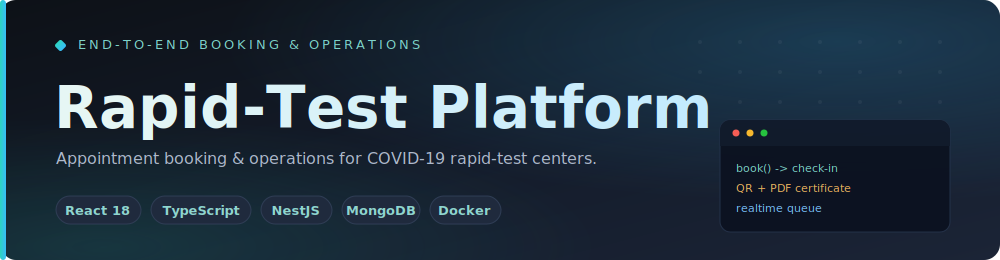

<br/>

<a href="https://github.com/A7med-Sghaier/rapid-test-booking-platform">
  
</a>

<br/><br/>

[](https://github.com/A7med-Sghaier/rapid-test-booking-platform/actions/workflows/portfolio-checks.yml)
[](LICENSE)
[](https://react.dev)
[](https://www.typescriptlang.org)
[](https://nestjs.com)
[](https://www.mongodb.com)


</div>

A full-stack booking and administration platform built for **COVID-19 rapid-test centers**: the
public books test slots, staff manage the daily queue, agents check people in and record antigen
results, and administrators handle settings, reports, **QR-coded PDF certificates**, and
health-office / Corona-Warn-App reporting.

> [!NOTE]
> This is a **portfolio-safe** build — Mailpit stands in for real SMTP, MongoDB is seeded with
> fake relative-date records, and CI scans for committed secrets. No production data ships here.

<div align="center"></div>

## Case Study

Rapid Test Booking Platform models the end-to-end workflow of a COVID-19 rapid-test center: members of the public book a test slot, staff manage the daily queue, agents check people in and record antigen test results, and administrators handle center settings, test persons, reports, result certificates, and health-office/Corona-Warn-App reporting.

It was built to handle the operational reality of a busy test site during the pandemic — high booking volume, fast walk-in check-in, same-day result delivery with a downloadable certificate, and the reporting obligations required of German test centers.

The portfolio focus is full-stack product delivery: a React/TypeScript frontend, a NestJS/MongoDB backend, Dockerized local infrastructure, safe demo seed data, local email capture, QR/PDF generation, and CI checks that keep the public repository buildable and safe to inspect.

Key users:

- Members of the public booking a COVID-19 rapid-test appointment from a public flow.
- Test-center agents handling check-in, antigen test results, and appointment status changes.
- Administrators managing appointments, agents, center settings, reports, and operational data.

Key engineering decisions:

- Docker Compose provides the supported demo path and avoids local Node/Yarn version drift.
- Mailpit replaces real SMTP so email workflows are visible without exposing credentials.
- MongoDB seed data uses fake, relative-date records so the dashboard stays useful after every clean start.
- GitHub Actions builds backend and frontend and scans for obvious committed secret patterns.

<div align="center"></div>

## Architecture

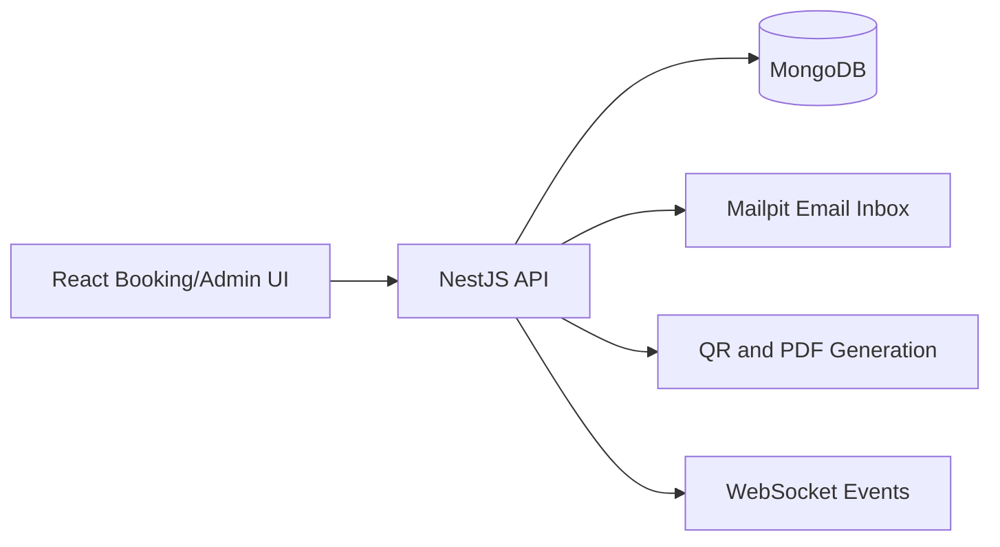

<div align="center"></div>

## Demo Preview

The screenshots below use safe local demo data and show the public booking flow plus the operational admin workspace.

### Client Booking Flow

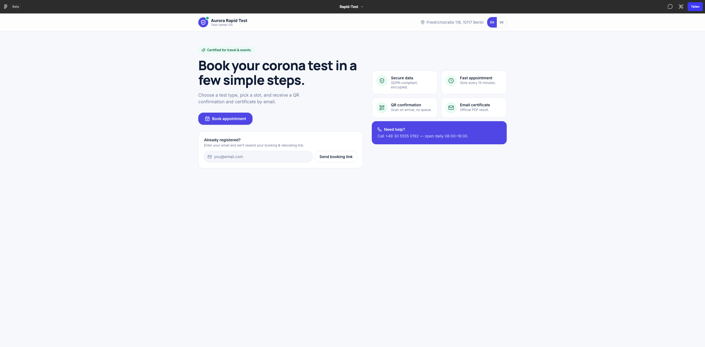

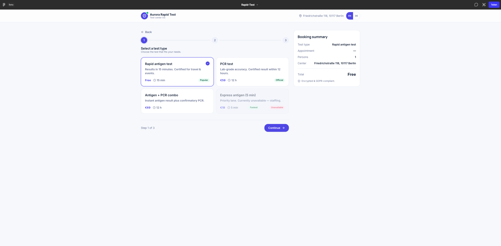

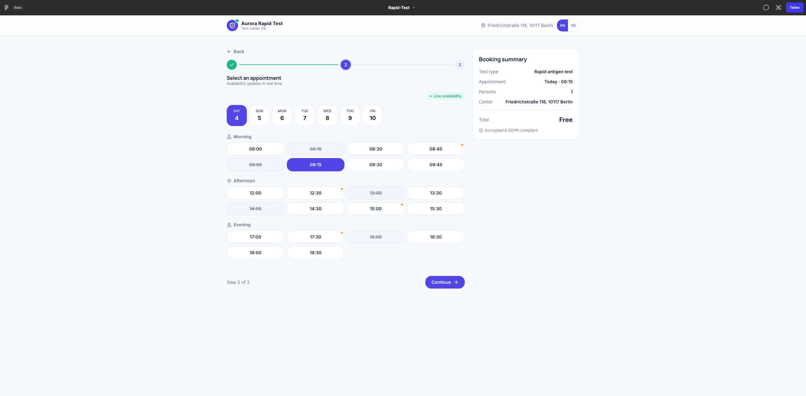

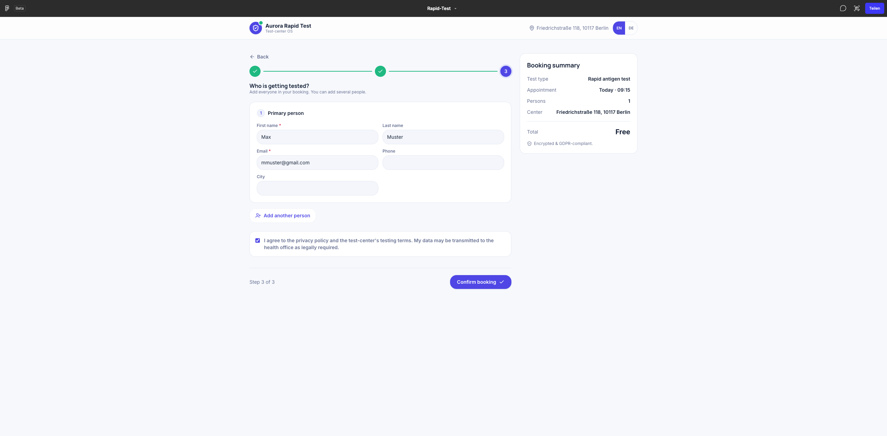

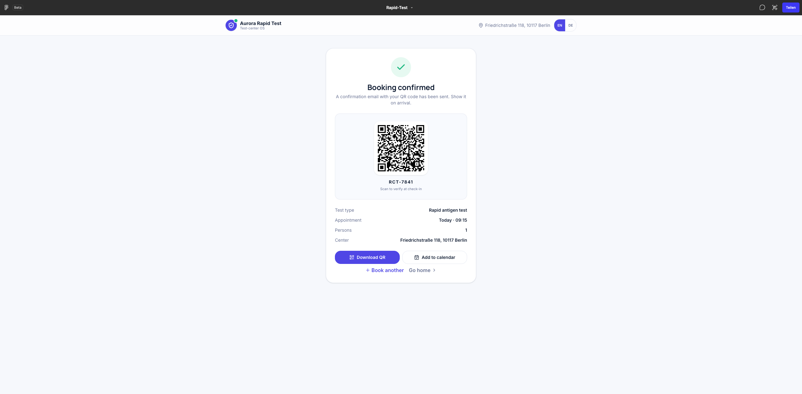

### Admin Dashboard

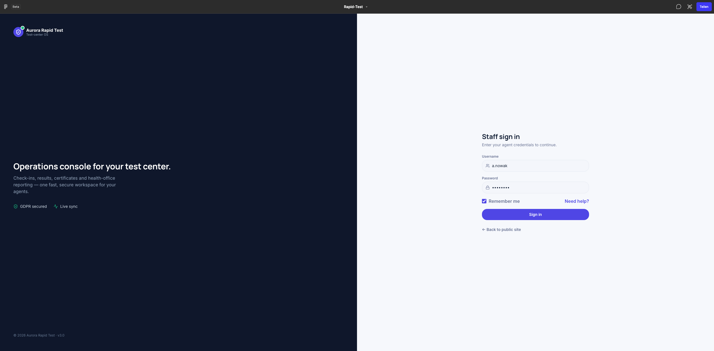

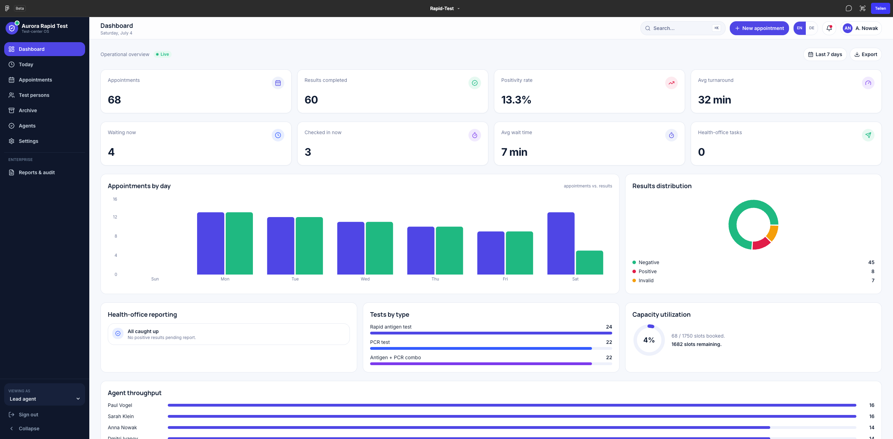

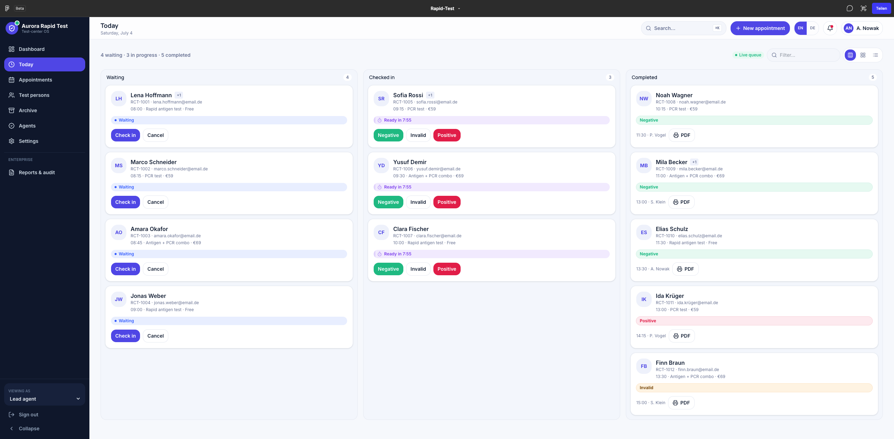

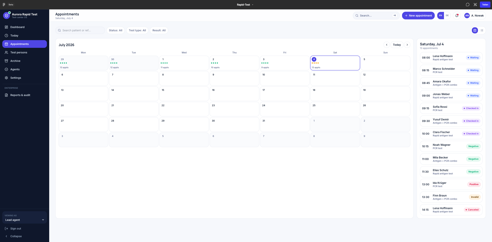

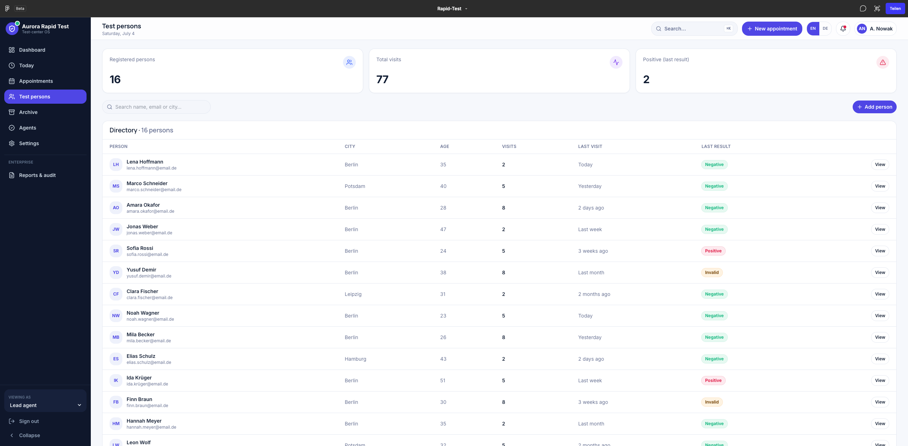

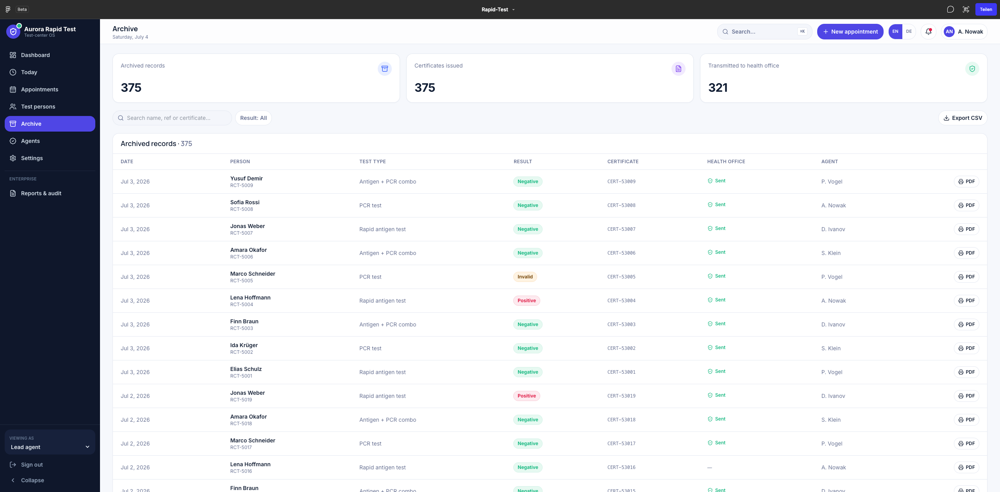

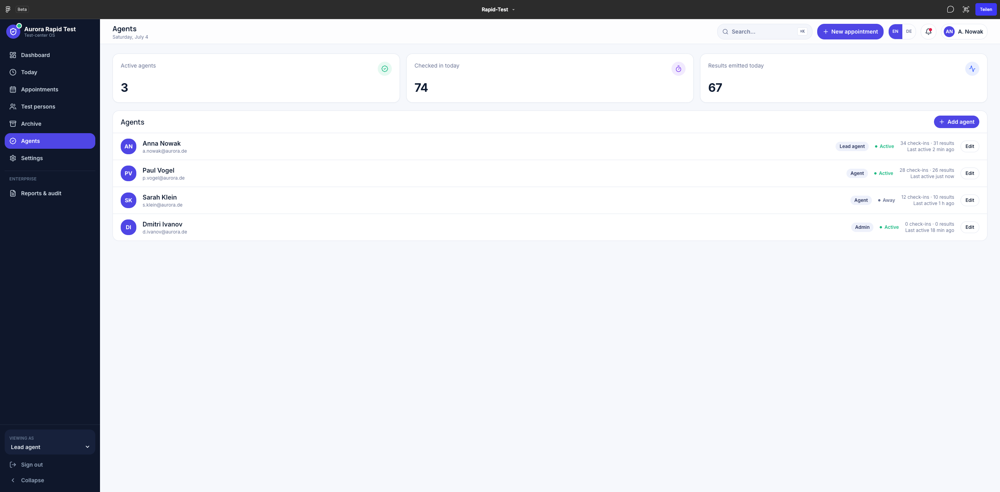

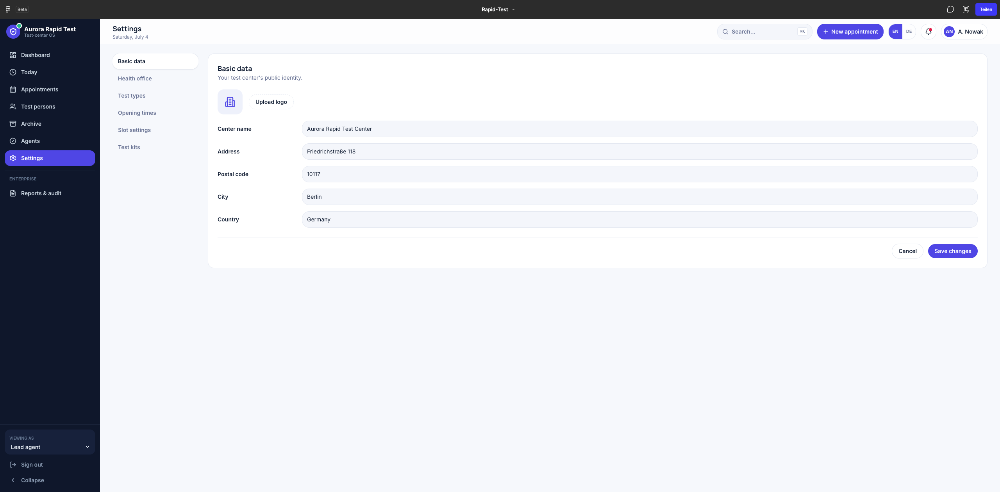

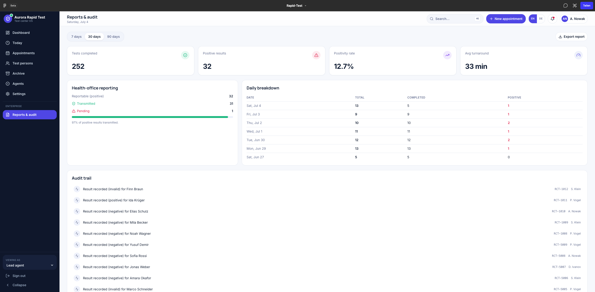

<div align="center"></div>

## Portfolio Highlights

- Built a multi-step COVID-19 rapid-test booking flow with React, TypeScript, Material UI, validation, localization, and responsive form components.
- Implemented an administration dashboard for appointments, agents, center settings, statistics, check-in and antigen-result workflows.
- Developed a NestJS backend with JWT authentication, MongoDB-backed persistence, email notifications, PDF test-certificate generation, QR code helpers, and WebSocket events.
- Added environment-based configuration for database, mail, auth, encryption, and integration settings.
- Included Docker-based local startup for the API, frontend, MongoDB, demo seed data, and local email capture.
- Included CI checks for backend build, frontend build, and obvious secret/file safety issues.

<div align="center"></div>

## Tech Stack

- Frontend: React 18, TypeScript, Vite, Material UI, Radix UI, Tailwind CSS, Recharts, React Router
- Backend: NestJS 8, TypeScript, MongoDB, Passport, JWT, Mailer, PDFKit, QR code generation, WebSockets
- Tooling: Docker Compose, Yarn Classic, Yarn Berry/Corepack, Jest, Vitest, ESLint, Prettier, GitHub Actions

<div align="center"></div>

## Repository Structure

```text
api-app/                 NestJS API, auth, appointments, administration, mail, QR, PDF, sockets, statistics
booking-app/             React booking and administration frontend
docker/mongo-init/       Safe local MongoDB demo seed data
scripts/run-all-stacks.sh Docker helper for running the full local stack
docker-compose.yml       Local API, frontend, MongoDB, and Mailpit stack
.env.example             Safe local configuration template
SECURITY.md              Public-release and secret handling notes
```

<div align="center"></div>

## Documentation

- [Architecture](docs/architecture.md): system overview, frontend/backend responsibilities, data flow, and portfolio value.
- [API overview](docs/api-overview.md): recruiter-friendly summary of the main backend routes and workflows.
- [Public release checklist](docs/public-release-checklist.md): safety checks before making the repository public.
- [Demo and screenshot plan](docs/demo-plan.md): safe screenshot plan for the README and portfolio profile.

<div align="center"></div>

## Docker Setup

The recommended local path is Docker. It avoids local Node/Corepack/Yarn version issues and starts the full stack together.

Requirements:

- Docker Desktop
- Docker Compose v2, or the legacy `docker-compose` command

Start everything:

```bash
bash scripts/run-all-stacks.sh up
```

Or run in the background:

```bash
bash scripts/run-all-stacks.sh upd
```

Open the app:

```text
Frontend: http://localhost:3010
API: http://localhost:3510/test-app-api
API docs (Swagger): http://localhost:3510/test-app-api/docs
Mailpit inbox: http://localhost:8025
MongoDB: localhost:27017
```

Demo admin login:

```text
Username: admin
Password: admin123
```

Demo data:

```text
MongoDB is seeded from docker/mongo-init with safe local demo settings, agents, and current/upcoming appointments.
Emails are captured locally in Mailpit instead of being sent through a real SMTP account.
```

The seed script in `docker/mongo-init` only runs automatically the first time
MongoDB starts on an empty data volume. If your `mongo-data` volume already
existed (for example from an earlier run), the seed is skipped and the demo
data will be missing. Re-seed the running database at any time with:

```bash
bash scripts/run-all-stacks.sh seed
```

The seed file is idempotent (it clears its own demo documents before
re-inserting), so it is safe to run repeatedly. Alternatively, `clean` wipes the
volume so the demo data is recreated automatically on the next startup.

Useful stack commands:

```bash
bash scripts/run-all-stacks.sh ps
bash scripts/run-all-stacks.sh logs
bash scripts/run-all-stacks.sh logs api
bash scripts/run-all-stacks.sh seed
bash scripts/run-all-stacks.sh down
bash scripts/run-all-stacks.sh clean
```

`seed` re-seeds the running MongoDB without touching the volume. `clean` removes
the Docker volume, so MongoDB demo data will be recreated on the next startup.

<div align="center"></div>

## Manual Local Setup

Use this only if you want to run packages outside Docker. The Docker setup is the supported portfolio demo path because it pins the backend and frontend runtime differences for you.

1. Create backend environment configuration:

```bash
cp .env.example api-app/.env
```

2. Install backend dependencies with Node.js 16 and Yarn Classic:

```bash
cd api-app
yarn install
yarn start:dev
```

3. Install frontend dependencies with Node.js 20 and Corepack/Yarn Berry:

```bash
cd ../booking-app
corepack enable
yarn install
yarn start
```

<div align="center"></div>

## Development Commands

Backend:

```bash
cd api-app
yarn build
yarn test
yarn lint
```

Frontend:

```bash
cd booking-app
yarn build
yarn test                       # Vitest unit tests
yarn typecheck
yarn playwright install chromium # one-time browser download
yarn e2e                        # Playwright smoke tests (booking + admin login)
```

The frontend design-system and feature components are developed and documented
in isolation with Storybook (stories are co-located as `*.stories.tsx`):

```bash
cd booking-app
yarn storybook         # run Storybook at http://localhost:6006
yarn build-storybook   # build the static Storybook site
```

<div align="center"></div>

## Verification

The GitHub Actions workflow installs dependencies, builds the backend, runs the full backend unit-test suite (`yarn test`), builds the frontend, runs the frontend Vitest suite, runs the Playwright smoke tests (public booking landing and admin sign-in), and scans for obvious committed secrets.

<div align="center"></div>

## Configuration

All sensitive runtime values should be provided through environment variables. See `.env.example` for placeholders covering:

- MongoDB connection settings
- Mail host/user/password
- JWT secret and encryption key
- Collection names
- Corona-Warn-App integration placeholders

Do not commit real credentials, real appointment records, customer data, test results, certificates, or deployment hostnames.

<div align="center"></div>

## Roadmap And Tradeoffs

This portfolio version keeps the original product scope visible while making the repository safe to inspect publicly.

Current tradeoffs:

- Docker is the supported demo path because the backend and frontend use different Node/Yarn generations.
- Authentication is hardened for the demo (bcrypt, JWT bearer auth, role guards); a production release would still layer on refresh tokens, rate limiting, and centralised secret management.
- Corona-Warn-App integration is represented with placeholder configuration only.

Recently added:

- Passwords are hashed with bcrypt (with a transparent fallback for legacy MD5 records) instead of raw MD5.
- Role-based access control: admin/statistics endpoints require a JWT bearer token, with agent-vs-admin role checks; the frontend attaches the stored token to API calls.
- Structured audit logs for appointment status changes (check-in, cancellation, result emission) written to an `auditLogs` collection.
- AES key derivation moved from SHA-1 to SHA-256 with a fresh per-request IV.
- Swagger/OpenAPI documentation is served at `/test-app-api/docs`.
- The full backend unit-test suite and Playwright smoke tests (public booking landing and admin sign-in) run in CI.

Potential next improvements:

- Expand unit tests beyond the current smoke coverage into behaviour-level backend and frontend suites.

<div align="center"></div>

## Current Portfolio Status

The repository has Docker setup, safe demo seed data, screenshot previews, CI build checks, frontend test coverage for API URL generation, and public-release safety notes. Before switching visibility to public, Ahmed should make one final manual review of screenshots and ownership boundaries.

<div align="center"></div>

## Portfolio Summary

Rapid Test Booking Platform demonstrates full-stack product delivery for a real-world COVID-19 rapid-test operation, across React, TypeScript, NestJS, MongoDB, authentication, operational dashboards, test-certificate generation, QR workflows, email notifications, and realtime app events.

<div align="center"></div>

## License

Released under the [MIT License](LICENSE).

<div align="center"></div>

<div align="center">

### Built by Ahmed Sghaier — Senior Full-Stack Engineer

[](https://www.linkedin.com/in/ahmed-sghaier-449778137)
[](mailto:a7mado008@gmail.com)
[](https://github.com/A7med-Sghaier)

</div>
